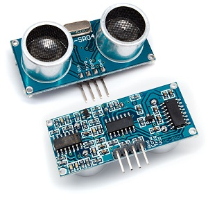
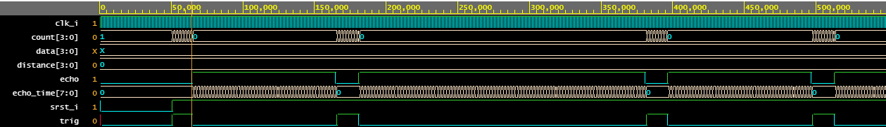
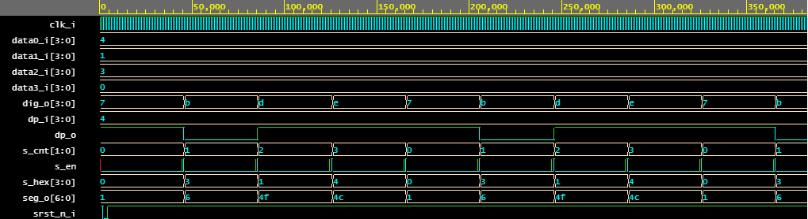

# Ultrazvukový merač vzdialenosti HC-SR4

### Utrazvukový merač
Funguje na princípe odrazu vysielaného ultrazku od okolitých objektov. Modul HC-SR4 obsahuje vysielač a prijímač, ďalej obsahuje štyri piny, dva slúžia na napájanie, tretí slúži na zahájenie merania (trigger) a posledný slúži ako výstupný pin (echo). Vlastné meranie prebieha tak, že na trigger sa privedie spúšťací inpulz vysokej úrovne v dĺžke trvania 10 µs, vysielač vyšle 8 meraných impulzov, tie vyhodnotí a na echo pin privedie signál vysokej úrovne odpovedajúcej dĺžky, ktorý sa následne spracuváva procesorom.

#### Obsah

1. [Zadanie](#Zadanie)
2. [Bloky kódu](#Bloky-kódu)
3. [Simulácia](#Simulácia)
4. [Schéma](#Schéma)
5. [Odkaz na EDA Playground](#Odkaz-na-EDA-Playground)
6. [Zdroje](#Zdroje)

## Zadanie

Ultrazvukový měřič vzdálenosti HC-SR04. Výstup na 7segmentovém displeji.

## Bloky kódu

Kód ultrazvukovéhu merača odsahuje päť hlavných blokov kódu, ktoré sú následne spojené do vrchného top modulu. Všetky bloky sú pripojené k vnútornému hodinovému signálu clk_i a resetovaciemu signálu srst_i, ktorý je aktívny v nízkej úrovni, a ktorým sa celé zaridenie vyresetuje do počiatočného stavu. 
- clock_enable
- sonar
- driver
- driver_7seg
- hex_to_7seg

### Clock_enable
Tento blok slúži na zosymchronizovanie celého zariadenia. Je v ňom možné nastaviť frekvenciu vysielania synchronizovacieho impulzu.

### Sonar
Tento blok je vstupný blok celého zariadenia. Jeho úlohou je vyslať pulz na začatie merania v určitej dĺžke a následne načítač dĺžku odrazeného pulzu echo. Toto číslo je potom vynásovené konštantov vdialenosti a dáta sú potom posielané do ďalšieho bloku dirver.

### Driver
Po prijatí dát od vstupného bloku je potrebné tieto dáta upraviť tak aby ich bolo možné zobraziť na sedemsegmentovom displayi ako jednotlivé čísla. Na tento účel slúži blok driver. Vstupný signál data_i je prevedený na typ premennej Integer, aby mohli byť jednoduchšie vykonávané matematické operácie. Pre určenie jednotiek daného čísla je použitá funkcia modulo 10, ktoré vráti hodnotu celočíselného zvyšku po delení 10. Pre získanie desiatok je číslo vydelené číslom 10 a potom je opäť použitá funkcia modulo 10. Pre stovky a tisíce sa postupoje obdobne. Všetky číslice sú opäť prevedené na signály a posielajú sa ďalej do bloku driver_7seg. 

### Driver_7seg
Tento blok obsahuje multiplexor, ktorý slúži na rozdelovanie hodnôt pre každý blok na sedemsegmentovom dispalyi. Je tým pádom zaistené, že číslo prisluchajúce jednotkám sa zobrazí na prvej pozícii, desiatkam na druhej atď.

### Hex_to_7seg
Tento blok slúži na prevod čísla v binárnej podobe na sedemsegmentové číslo, ktoré sa následne zobrazí na displayi.

## Simulácia

#### Simulácia clock_enable

#### Simulácia sonaru

#### Simulácia driveru

#### Simulácia display driveru_7seg

#### Simulácia top modulu
Simulácia top modulu prebieha tak, ako keby sme v skutočnosti zmerali nejakú vzdialenosť. Keďže nemáme k dispozícii ultrazvukový merač meranie uskutočňujeme pomocou testbenchu, kde počkáme na koniec spúšťacieho signálu trigger, a potom na echo pin privedieme najprv pulz s dĺžkou 100 ns a potom 246 ns.

## Schéma

TBD

## Odkaz na EDA Playground

## Zdroje

https://cdn.sparkfun.com/datasheets/Sensors/Proximity/HCSR04.pdf
https://forum.arduino.cc/index.php?topic=113226.0
